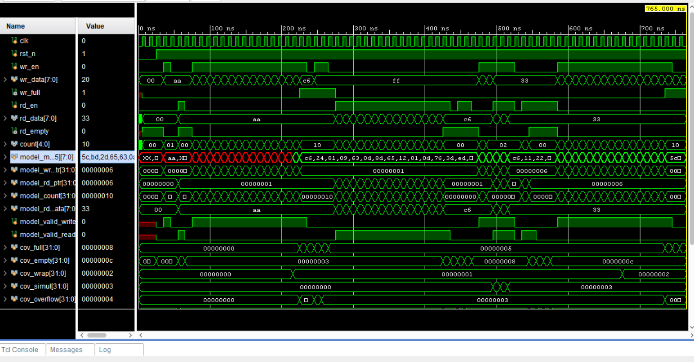

# Assignment 2: Synchronous FIFO Verification

Name-Abhinav Yadaram                         ID-2023B5A30999G

## Directory Structure
- `rtl/sync_fifo_top.v` : The complete implementation of the Synchronous FIFO hardware.
- `tb/tb_sync_fifo.v`   : Self-checking testbench featuring a golden reference model, automated scoreboard, directed testing, and coverage counters.
- `docs/README.md`      : Documentation and submission details.
- `docs/waveform_results.png` : Screenshot of the successful simulation.

## Features
* Parameterized data width and depth.
* Cycle-accurate Golden reference model.
* Automated Scoreboard validation terminating on failure.
* Complete directed testing covering bounds, wraps, and concurrency.

## Simulation Results
The testbench successfully completed all directed tests with zero scoreboard mismatches. All manual coverage metrics (full, empty, wrap, simultaneous, overflow, and underflow) were triggered successfully. 

Below is the waveform showing the final successful simulation state and coverage counter values:

